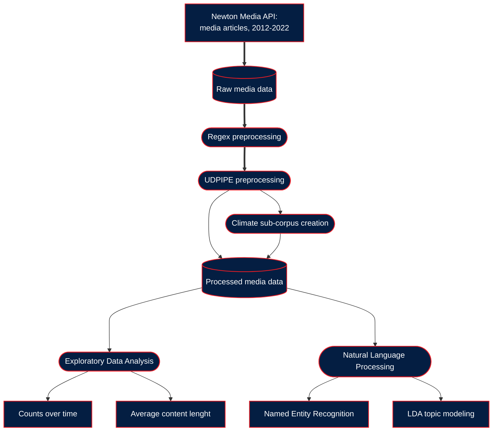

# Czech Public Television and Climate Change Reporting, 2012-2022

*Andrea Culkova (Academy of Performing Arts in Prague)  
Ondrej Pekacek (Charles University)  
Irena Reifova (Charles University)  
Irene Elmerot (Stockholm University)*

## A transformative journalism perspective

This is a research project examining the coverage of climate change by Czech public media outlets, ČT 1 and ČT 24.
The repository contains scripts, data and documentation for the computational part of the overall analysis.

### Project workflow diagram

